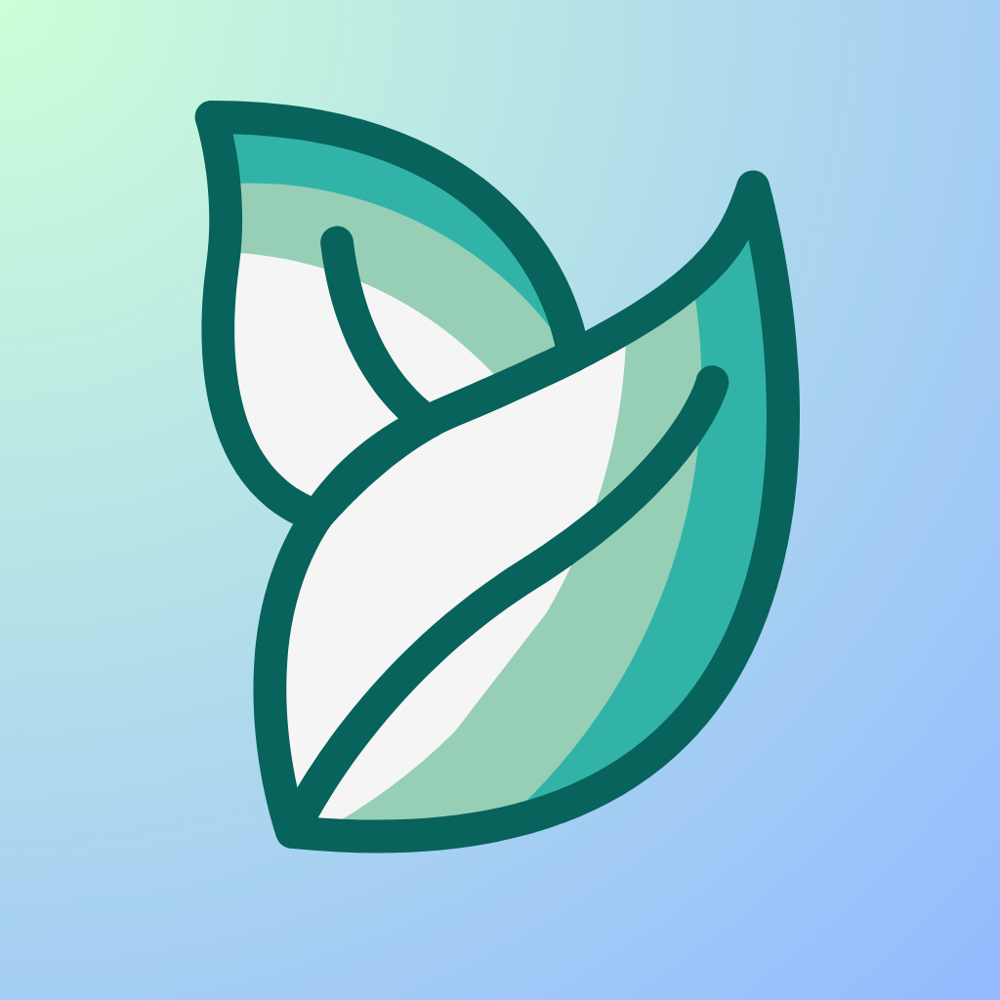

# Cue

<p align="center">
  
</p>

<p align="center">
  <strong>A streamlined, distraction-free academic agenda for iOS.</strong><br>
  Seamlessly syncs with Canvas LMS calendar feeds to deliver a clean, color-coded, and offline-first task experience.
</p>

<p align="center">
  
  
  
  
  
</p>

---

## 📖 Overview

As university course loads expand, keeping track of deadlines across Canvas, syllabi, and external tools becomes overwhelming. The official Canvas Student mobile app is often sluggish, burdened by nested navigation, and lacks a fast, focused overview of what is due **today**.

**Cue** was engineered as an elegant, privacy-first solution to this problem. By consuming standard iCalendar (`.ics`) feeds exported by Canvas LMS, Cue eliminates the need for manual to-do entry or credential sharing. It parses course feeds asynchronously, sanitizes academic metadata, and organizes deadlines into a focused, glassmorphic dashboard built natively with **SwiftUI** and **SwiftData**.

---

## ✨ Key Features

- **Automated Canvas Feed Ingestion**: Connect once using your Canvas `.ics` calendar URL. Cue periodically fetches and synchronizes assignments without storing passwords or school login credentials.
- **Smart Assignment Engine**:
  - **Dynamic Title Sanitization**: Parses raw calendar summaries (e.g., `Homework 4 [CS 101]`), automatically isolating assignment names from course tags.
  - **Contextual Status Computation**: Real-time state evaluation marking items as *Complete*, *Overdue*, *Submitted Late*, or *Not Complete*.
  - **Temporal Categorization**: Organizes workloads dynamically into **Due Today** and **Upcoming** with due-time awareness.
- **Course Personalization & Color Palette**:
  - Assign personalized class display names (e.g., convert `FA25-BIO-101-002` to `Biology`).
  - Custom color coding with persistent RGBA serialization across app launches.
- **Modern iOS Native Aesthetics**:
  - Built with SwiftUI's modern glassmorphic materials (`.glassEffect`).
  - Full Light and Dark Mode parity with bespoke dynamic asset catalogs.
  - Fluid swipe actions for course management and quick color customization.
- **100% Offline-First**: All data is stored locally on device using SwiftData, ensuring instant launch times and zero network latency when reviewing tasks.

---

## 🏛️ System Architecture

Cue adopts a reactive, unidirectional data flow built around modern Swift Concurrency and SwiftData:

```mermaid
flowchart TD
    subgraph Network & Parsing ["Background Layer (Actor-Isolated)"]
        CanvasFeed["Canvas LMS (.ics URL)"] -->|URLSession async| Parser["ICSParser (Actor)"]
        Parser -->|iCalendarParser RFC-5545| TempStructs["[ParsedClass] / [ParsedAssignment] (Sendable)"]
    end

    subgraph StateManagement ["Coordination Layer (@MainActor)"]
        TempStructs -->|Async Hand-off| Manager["ICSManager (@Observable)"]
        Manager -->|Diffing & Upsert Pipeline| Context["ModelContext (SwiftData)"]
    end

    subgraph Persistence ["Persistence Layer"]
        Context --> ClassModel["Class (@Model)"]
        Context --> AssignmentModel["Assignment (@Model)"]
        ClassModel -->|Cascade Delete 1:N| AssignmentModel
    end

    subgraph Presentation ["UI Layer (SwiftUI)"]
        ClassModel -.->|@Query Observation| ListView["ListView (Dashboard)"]
        AssignmentModel -.->|Reactive Binding| DetailsView["AssignmentDetailsView"]
        AssignmentModel -.->|Status Toggle| CardView["AssignmentListView"]
    end
```

### Architectural Highlights

1. **Actor-Isolated Background Processing (`ICSParser`)**:
   - Network I/O and CPU-bound parsing of RFC-5545 iCalendar strings take place within an isolated Swift `actor` (`ICSParser`).
   - By decoupling data serialization from the UI runtime, large course calendars with hundreds of events never induce frame drops or main-thread hitches.
2. **Reconciliation & Diffing Pipeline (`ICSManager`)**:
   - Rather than wiping the database on every sync, `ICSManager` performs an intelligent upsert:
     - Matches incoming events against existing records using unique `icsUID` attributes.
     - Preserves user completion state (`isComplete`) while updating modified deadlines, descriptions, and titles.
     - Prunes obsolete assignments and auto-removes empty course containers.
3. **Relational SwiftData Schema**:
   - Entities (`Class` and `Assignment`) utilize SwiftData's macro system (`@Model`) with explicit delete rules (`@Relationship(deleteRule: .cascade)`).
   - Queries use declarative `@Query` macros with dynamic sort descriptors for responsive, zero-boilerplate UI updates.
4. **Persistent RGBA Color Engine**:
   - Implemented a custom cross-platform color conversion bridge (`ColorExtensions.swift`) extracting normalized `(red, green, blue, alpha)` components from `UIColor`/`NSColor`.
   - Allows user-selected colors from SwiftUI `ColorPicker` to be preserved across app launches within lightweight SwiftData numeric attributes.

---

## 📂 Project Structure

```text
Cue/
├── CueApp.swift                # App entry point & SwiftData ModelContainer configuration
├── Models/
│   ├── Class.swift             # SwiftData entity for courses, RGBA attributes, & computed lists
│   └── Assignment.swift        # SwiftData entity for assignments & status state machine
├── Managers/
│   ├── ICSManager.swift        # Main-actor state manager, diffing & SwiftData reconciliation
│   └── ICSParser.swift         # Actor-isolated URLSession fetcher & RFC-5545 feed parser
├── Views/
│   ├── Screens/
│   │   ├── ContentView.swift   # Main tab navigation shell
│   │   ├── ListView.swift      # Primary dashboard (Courses, Due Today, Upcoming)
│   │   ├── SetupView.swift     # Canvas .ics feed onboarding & step-by-step tutorial
│   │   ├── AssignmentDetailsView.swift # Detailed assignment view & submission toggle
│   │   └── LoadingScreen.swift # Loading state placeholder
│   ├── ListItems/
│   │   ├── ClassListView.swift      # Glassmorphic course capsule row
│   │   ├── AssignmentListView.swift # Assignment row with interactive completion circle
│   │   └── ClassView.swift          # Single-course filtered assignment view
│   └── Other/
│       ├── ClassColorPicker.swift   # Color palette selection & course rename sheet
│       └── StepRow.swift            # Numbered timeline indicator for setup instructions
├── Extensions/
│   └── ColorExtensions.swift   # RGBA component extraction for SwiftData persistence
└── Assets.xcassets/             # Dynamic Light/Dark color sets & app icon assets
```

---

## 🛠️ Tech Stack & Dependencies

| Layer | Technologies |
| :--- | :--- |
| **Language** | Swift 5.9+ / Swift 6 Ready |
| **UI Framework** | SwiftUI (iOS 17+) |
| **Data Persistence** | SwiftData (`@Model`, `@Query`, `ModelContainer`) |
| **Concurrency** | Swift Concurrency (`async`/`await`, `actor`, `@MainActor`, `Sendable`) |
| **Third-Party SPM** | [iCalendarParser](https://github.com/dmail-me/iCalendarParser) (RFC-5545 iCalendar specification parser) |
| **Architecture** | Unidirectional Data Flow with `@Observable` & SwiftData |

---

## 🚀 Getting Started

### Prerequisites

- macOS Sonoma 14.0 or newer
- Xcode 15.0 or newer
- iOS 17.0+ Simulator or Physical Device

### Installation

1. **Clone the repository:**
   ```bash
   git clone https://github.com/Isaac614/Cue.git
   cd cue
   ```

2. **Open in Xcode:**
   ```bash
   open Cue.xcodeproj
   ```

3. **Resolve Package Dependencies:**
   Xcode will automatically resolve the `iCalendarParser` package via Swift Package Manager. If needed, navigate to:
   `File > Packages > Resolve Package Versions`.

4. **Select Target & Run:**
   - Choose an iOS 17+ Simulator (e.g., iPhone 15 Pro).
   - Press `Cmd + R` to build and launch the application.

---

## 📲 How to Connect Canvas

1. Open your university's Canvas website in a web browser (e.g., Safari or Chrome).
2. Navigate to the **Calendar** tab on the global sidebar.
3. Locate and click the **Calendar Feed** link at the bottom right.
4. Copy the `.ics` feed URL.
5. In **Cue**, navigate to the **Add (+) / Setup** tab, paste your link, and tap **Connect Calendar**.

---

## 🛣️ Roadmap & Future Enhancements

- [ ] **Interactive Widgets (WidgetKit)**: Home Screen and Lock Screen widgets for checking off "Due Today" tasks without opening the app.
- [ ] **Live Activities (ActivityKit)**: Dynamic Island countdowns for urgent assignments due within 2 hours.
- [ ] **Background Refresh (`BackgroundTasks`)**: Silent synchronization overnight to ensure fresh assignments every morning.
- [ ] **Haptic Feedback**: Tactile responses via `UIImpactFeedbackGenerator` when checking off assignments.
- [ ] **Notifications (`UserNotifications`)**: Configurable reminders (e.g., 24h and 2h before submission deadlines).

---

## 👤 Author

**Isaac Moore**
- GitHub: [@Isaac614](https://github.com/Isaac614)
- Repository: [Isaac614/Cue](https://github.com/Isaac614/Cue)

---

## 📄 License

This project is licensed under the [MIT License](LICENSE) — see the repository for details.
